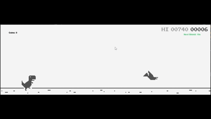

# chrome-dino-game
A Java-based 2D runner game inspired by the Chrome Dinosaur Game, built as part of an academic project. The game features obstacles, scoring, power-ups like shields, coin collection, day-night transitions, and more — all rendered using simple Java graphics and compiled into a runnable `.jar` file.

---
## Features

- Side-scrolling endless runner  
- Obstacles: Cactuses and birds  
- Power-ups: **Shields** that provide temporary protection from collisions  
- Score counter and increasing difficulty  
- **Collectible coins** that increase the player's score when picked up  
- Day/Night color transitions for dynamic visual effects  

---
## Demo

---
##  Project Structure
``` yaml
dino_game/
├── compiled/                # Compiled .class files (organized by package)
│ ├── game_object/              # Game entities: Dino, Birds, Cactuses, Land, etc.
│ ├── manager/                  # Handles enemy logic, sound playback, input control
│ ├── misc/                     # Game states, control actions, enums (e.g., DinoState)
│ ├── resources/                # Embedded resources (sprites, sounds, text)
│ ├── user_interface/           # Game window and screen rendering logic
│ └── util/                     # Resource loader and helper utilities
│
├── resources/               # External assets: images, sounds, fonts, text files
│ ├── *.png                     # Sprites for dino, birds, obstacles, UI
│ ├── *.wav                     # Sound effects (jump, dead, scoreup)
│ └── *.txt                     # Score or config data
│
├── src/                     # Java source code (same package structure as compiled/)
│ ├── game_object/               # Source for all game objects and entities
│ ├── manager/                   # Source for enemy/spawn/sound/control managers
│ ├── misc/                      # Source for enums and control state classes
│ ├── user_interface/            # Source for UI classes (game screen/window)
│ └── util/                      # Source for asset loading, resource handling
│
├── dino.jar                 # Runnable Java Archive containing the compiled game
├── dino_game_demo           # Demo video for the game

```
---

##  How to Run the Game

1. Ensure Java is installed:
   ```bash
   java -version
   ```
2. Navigate to the project directory and run:
   ``` bash
   javac -d compiled -sourcepath src src/user_interface/GameWindow.java
   java -cp compiled user_interface.GameWindow
   ```
3. Use arrow keys or spacebar (based on your keybinds) to control the dinosaur.
   
   ---
## License
This project is licensed under the Creative Commons BY-NC 4.0 License.
You may use and modify it for non-commercial purposes with attribution.

---
## Acknowledgements

- This project was developed as part of an academic assignment.
- Inspired by the original [Chrome Dino Game](https://chromedino.com/), with added features like coin collection and shields.
- Built using Java and object-oriented programming concepts.
- Uses basic graphics and key event handling for animation and controls.
- Console effects use [ANSI Escape Codes](https://en.wikipedia.org/wiki/ANSI_escape_code) for rendering transitions.
- All sprites and sound effects used are open-source/public domain.


